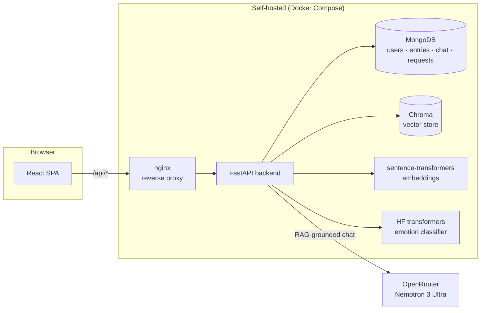

# Conscient

**Talk to your own diary.**

Conscient is a journaling app where the AI companion actually reads your past
entries before it responds — a real retrieval-augmented generation (RAG)
pipeline over your own diary, not a chatbot bolted on next to it. Every entry
also gets tagged with an emotion by a local classifier, and you can
optionally get matched with other users going through something similar
(matched on mood patterns only — your diary content is never shared).

## Why this exists

This started as an old group project with a lot of aspirational README bullet
points ("self-learning AI", "Random Forest classifier") that didn't actually
correspond to working code — the chat feature was a static prompt with no
memory, diary entries and chat were completely disconnected, and there were
three API keys hardcoded and committed to git history. It's been rebuilt from
the ground up into something that actually does what it claims, and doubles
as a portfolio piece covering full-stack, AI/RAG, and self-hosted deployment
work.

## How it works



1. You write a diary entry. If "AI Access" is on, it's embedded
   (`sentence-transformers/all-MiniLM-L6-v2`) into a per-user Chroma index,
   and a HuggingFace emotion classifier
   (`j-hartmann/emotion-english-distilroberta-base`) tags it with a mood —
   both run as a background task so saving stays instant.
2. When you chat, the backend retrieves your most relevant past entries
   (filtered to you, never other users) via a LangChain pipeline, feeds them
   into the prompt alongside recent conversation history, and calls an LLM
   through OpenRouter. Responses come back with citations pointing at the
   specific entries that grounded them.
3. Connect matches you with other users by aggregating mood patterns across
   everyone's entries in one MongoDB aggregation query — never by reading
   anyone's actual diary content.

## Tech stack

| Layer | Choice | Why |
|---|---|---|
| Frontend | React + Vite + TypeScript, Tailwind, shadcn/ui | Fast dev loop, typed, and shadcn keeps components ownable rather than a black-box UI kit |
| Backend | FastAPI + Beanie (async Mongo ODM) | Async-native, Pydantic models double as request/response schemas, good fit for I/O-bound RAG calls |
| Database | MongoDB, self-hosted in Docker Compose | Document model fits diary entries/chat naturally; used here alongside a dedicated vector store rather than forcing everything into one datastore. Runs as its own container, network-isolated (no auth needed since it's unreachable outside the compose network) |
| Vector store | Chroma (self-hosted, persisted to disk) | No external vector DB dependency for a self-hosted deploy; swappable for Qdrant/pgvector later without touching the retrieval interface |
| Embeddings | `sentence-transformers` (local, free) | No per-request cost or API key for the thing that runs on every diary save |
| Emotion classification | HuggingFace `transformers` pipeline | Runs locally, no API cost; accuracy is honestly evaluated (see [`backend/evals`](backend/evals)) rather than assumed |
| LLM orchestration | LangChain (`ChatPromptTemplate` + `ChatOpenAI` + Chroma retriever) | Real retrieval chain, not a hand-rolled prompt string — swapping models/providers is a config change |
| LLM provider | OpenRouter, `nvidia/nemotron-3-ultra-550b-a55b:free` | Free tier, OpenAI-compatible API |
| Auth | JWT (python-jose) + bcrypt | Stateless, standard |
| Deployment | Docker Compose + nginx reverse proxy, self-hosted behind a Cloudflare Tunnel | One origin for frontend + API (no CORS to manage), no ports exposed beyond localhost, TLS handled entirely by Cloudflare |
| CI | GitHub Actions | Lint + typecheck + test + build on every push, backend tests against a real Mongo service container |

## Project structure

```
src/                  React frontend
backend/
  app/
    api/routes/       auth, diary, chat, connect
    services/         vectorstore, chat_chain, emotion
    models/           Beanie documents (User, DiaryEntry, ChatMessage, ConnectionRequest)
    core/             config, JWT/password handling
  evals/              emotion classifier eval script
  tests/              pytest suite (auth, diary, chat, connect)
Dockerfile            frontend build -> nginx
backend/Dockerfile    FastAPI + pre-baked ML models
docker-compose.yml    the whole stack
DEPLOY.md             self-hosting runbook
```

## Local development

**Frontend:**
```bash
npm install
cp .env.example .env       # VITE_API_URL, defaults to http://localhost:8000
npm run dev                # http://localhost:3000
```

**Backend:**
```bash
cd backend
python3 -m venv .venv && source .venv/bin/activate
pip install -r requirements-dev.txt
cp .env.example .env       # MongoDB URI, JWT secret, OpenRouter key
uvicorn app.main:app --reload
```

You'll need a local MongoDB for dev (`docker run -d -p 27017:27017 mongo:7`
is the quickest way) and a free [OpenRouter](https://openrouter.ai/keys) API
key. Mongo itself is self-hosted for the deployed app too — see
[DEPLOY.md](DEPLOY.md), no third-party database account required.

## Testing

```bash
# Frontend
npm run lint && npm run typecheck && npm run test

# Backend (needs a Mongo instance reachable at MONGODB_URI)
cd backend && python -m pytest tests/ -v

# Emotion classifier accuracy against hand-labeled examples
cd backend && python -m evals.emotion_eval
```

## Self-hosting

See [DEPLOY.md](DEPLOY.md) — built around Docker Compose plus an existing
Cloudflare Tunnel, but the compose file works anywhere Docker runs.

```bash
docker compose up -d --build
```

## License

MIT — see [LICENSE](LICENSE).
